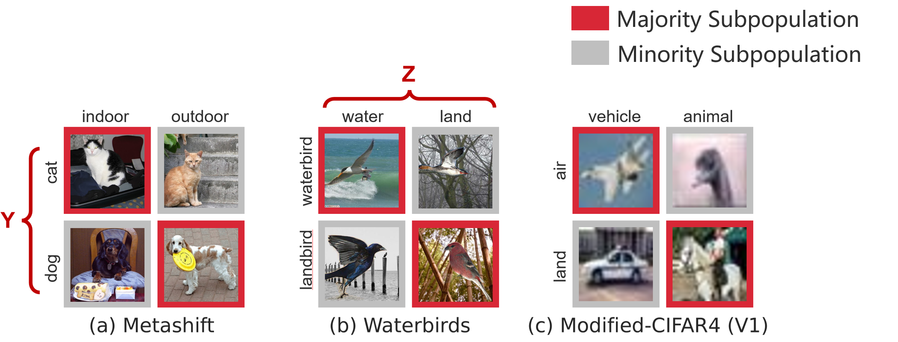
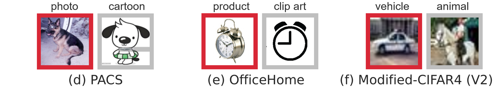
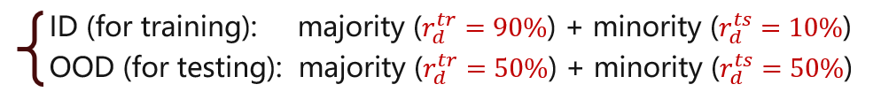
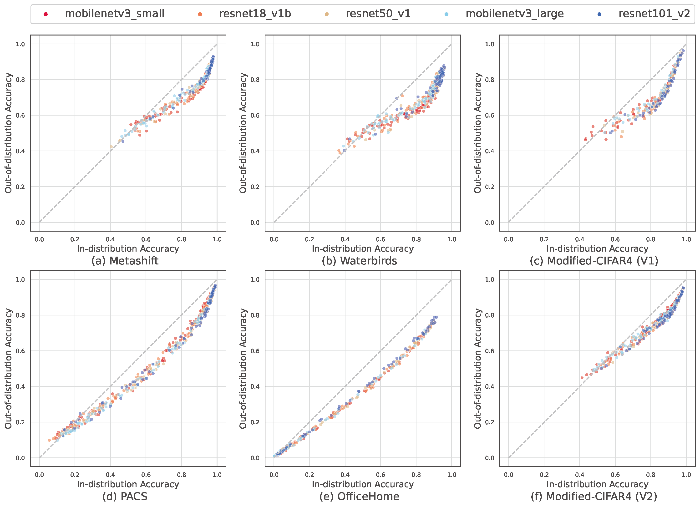
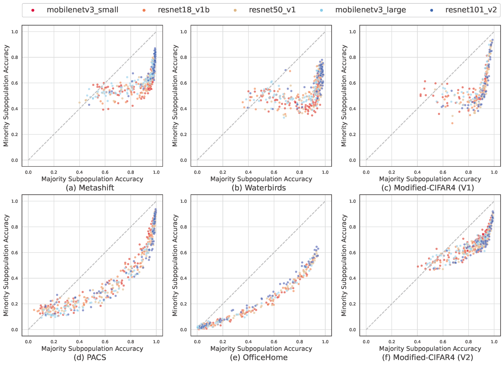
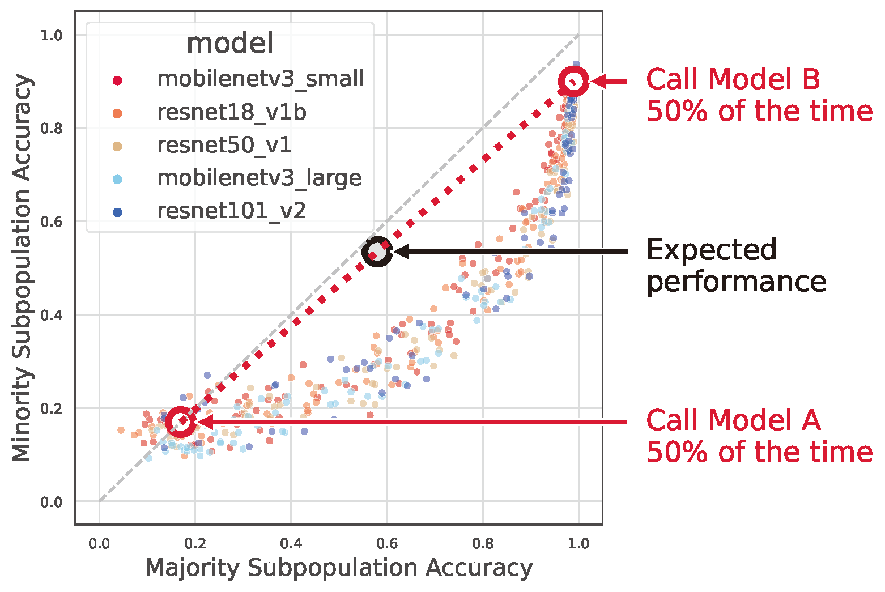
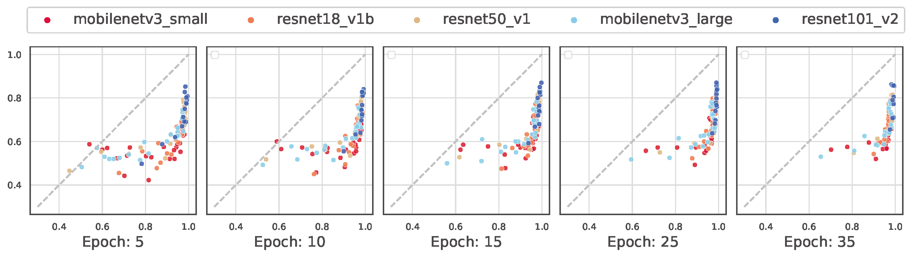
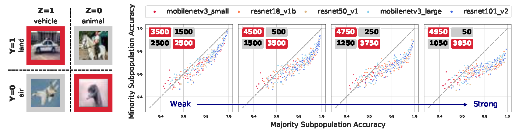
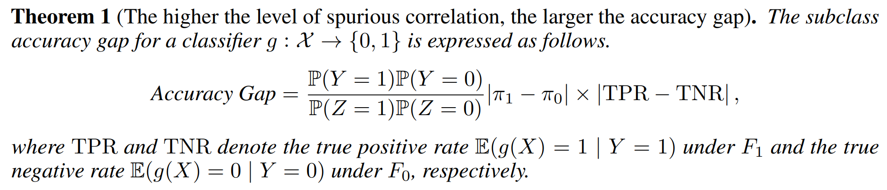

On the Nonlinear Correlation of ML Performance between Data Subpopulations
===============================================================================================

|Website shields.io| |Documentation Status| |License| |arXiv| |Python 3.6| |Pytorch| 

|Made withJupyter| 

.. |Website shields.io| image:: https://img.shields.io/website-up-down-green-red/http/shields.io.svg
   :target: https://modalitygap.readthedocs.io/
.. |Documentation Status| image:: https://readthedocs.org/projects/modalitygap/badge/?version=latest
   :target: http://modalitygap.readthedocs.io/?badge=latest
.. |License| image:: https://img.shields.io/badge/License-MIT-blue.svg
   :target: https://lbesson.mit-license.org/
.. |arXiv| image:: https://img.shields.io/badge/arXiv-2203.02053-green.svg
   :target: https://arxiv.org/abs/2203.02053
.. |Python 3.6| image:: https://img.shields.io/badge/python-3.6-blue.svg
   :target: https://www.python.org/downloads/release/python-360/
.. |Pytorch| image:: https://img.shields.io/badge/Pytorch-1.8-red.svg
   :target: https://pytorch.org/
.. |Made withJupyter| image:: https://img.shields.io/badge/Made%20with-Jupyter-orange?style=for-the-badge&logo=Jupyter
   :target: https://jupyter.org/try

Welcome! This is the project website of our paper: `On the Nonlinear Correlation of ML Performance between Data Subpopulations`
(Under Review). 

Abstract
--------

*Understanding the performance of machine learning models across diverse 
data distributions is critically important for reliable applications. 
Recent empirically works find that there is a strong linear relationship 
between in-distribution (ID) and out-of-distribution (OOD) performance, 
but we show that this is not necessarily true if there are subpopulation shifts. 
In this paper, we empirically show that out-of-distribution performance often 
has nonlinear correlation with in-distribution performance under 
subpopulation shifts. To understand this phenomenon, we decompose 
the model's performance into performance on each subpopulation. 
We show that there is a "moon shape" correlation (parabolic uptrend curve) 
between the test performance on the majority subpopulation and 
the minority subpopulation. This nonlinear correlations hold across 
model architectures, training durations and hyperparameters, 
and the imbalance between subpopulations. Moreover, we show that
the nonlinearity increases in the presence of spurious correlations 
in the training data. We provide complementary theoretical and 
experimental analyses for this interesting phenomenon of nonlinear 
performance correlation across subpopulations. Finally, we discuss 
the implications of our findings for ML reliability and fairness.*

**TL;DR:** We show that there is a “moon shape” correlation (parabolic uptrend curve) 
between the test performance on the majority subpopulation and the minority subpopulation.
This nonlinear correlations hold across model architectures, training settings, 
datasets, and the imbalance between subpopulations.

.. image:: ./figures/moonshape-poster.png
    :alt: my-picture1

Introduction
-------------------------

Subpopulation shift is a major challenge in ML: test data often have different 
distribution across subgroups (e.g. different types of users or patients) 
compared to the training data.
Recent works find a strong linear relationship between ID and OOD performance 
on dataset reconstruction shifts; In contrast, we empirically show that 
they have a nonlinear correlation under subpopulation shifts.

Experimental setup
-------------------------
Preliminaries: ML with diverse subpopulations
~~~~~~~~~~~~~~~~~~~~~~~~~~~~~~~~~~~~~~~~~~~~~~~~~
We consider the setting where the overall data distribution has a 
:math:`\mathcal{D}=\{1,\ldots,D\}` diverse subpopulations. 
Each subpopulation :math:`d\in \mathcal{D}` corresponds to a fixed data distribution :math:`P_d`. 
In each of our main experiment, we compare the performance on two data distributions. 

**(1) in-distribution (ID)**, or the training distribution,  
:math:`P^{tr}=\sum_{d\in \mathcal{D}}r_d^{tr} P_d`, where :math:`\{r_d^{tr}\}` denotes 
the mixture probabilities in the training set. 
After model training, we sample additional held-out samples from the in-distribution to compute ID performance. 

**(2) out-of-distribution (OOD)** is also a mixture of the :math:`\mathcal{D}` subpopulations, 
:math:`P^{ts}=\sum_{d\in \mathcal{D}}r_d^{ts} P_d`, where :math:`\{r_d^{ts}\}` is the 
mixture probabilities in the test set, but with a different proportion of subpopulations, 
i.e., :math:`\{r^{ts}_d\}\neq \{r^{tr}_d\}`. 
This setting is known as *subpopulation shifts*, and it has been well-documented in the 
literature that ML models often perform poorly on under-represented demographics. 

Subpopulation Shift Datasets
~~~~~~~~~~~~~~~~~~~~~~~~~~~~~~~~~~~~~~~~~~~~~~~~~
**(1) Spurious correlation.** 
If a target variable is correlated with another variable Z in the training distribution, 
the model may learn to rely on Z to make predictions.

   **Figure 1: Spurious correlation**

**(2) Rare subpopulation.**
Without obvious spurious correlation, ML models can still underperform on subpopulations that
occur infrequently in the training set (e.g. patients with a darker skin tone, photos taken at night). 
Since the rare subpopulation will not significantly affect model loss during training, the model may fail to learn to classify examples within this subpopulation. 

   **Figure 2: Rare subpopulation**

Experimental Procedure
~~~~~~~~~~~~~~~~~~~~~~~~~~~~~~~~~~~~~~~~~~~~~~~~~
We consider :math:`\mathcal{D}=2` subpopulations, namely majority subpopulation and minority subpopulation:

Procedures on each dataset:

1. Train 500 ML models :math:`{f_1, f_2, …}` with different

   - Model architectures
   - Training durations
   - Hyperparameters

2. Evaluate the ID/OOD performance

The Moon Shape Phenomenon
--------------------------------------------------------------

We empirically show the nonlinear correlation between 
the out-of-distribution performance and the in-distribution performance across 
multiple subpopulation shifts datasets. 
To understand this phenomenon, we decompose the model's performance into performance on each subpopulation. 
We also found *nonlinear* correlation between the test performance on the *majority subpopulation* 
and the *minority subpopulation*. 
Moreover, this nonlinear correlations hold across model architectures, 
training durations and hyperparameters, and the imbalance between subpopulations. 

Finding 1: nonlinear correlation of ML performance across data subpopulations
~~~~~~~~~~~~~~~~~~~~~~~~~~~~~~~~~~~~~~~~~~~~~~~~~~~~~~~~~~~~~~~~~~~~~~~~~~~~~

Part 1: Out-of-distribution vs. in-distribution accuracies
^^^^^^^^^^^^^^^^^^^^^^^^^^^^^^^^^^^^^^^^^^^^^^^^^^^^^^^^^^^^^^^^^^^^^^^^^^

   **Figure 3: Out-of-distribution accuracies vs. in-distribution accuracies under subpopulation shifts**

On each dataset, we trained 500 different models independently, with different model architectures and hyperparameters. 
The training distribution, or in-distribution, contains a majority subpopulation 
(over-represented in training data (e.g., :math:`90\%`)), and a 
minority subpopulation (under-represented in training data (e.g., :math:`10\%`)). 
In the out-of-distribution, the majority subpopulation and minority subpopulation are equally represented. 
Within each panel, each dot corresponds to a different model trained with different hyperparameter 
settings, and they are colored by their architecture. 
The x-axes indicate in-distribution accuracy and the y-axes indicate out-of-distribution accuracy. 
Overall, there are *striking nonlinear correlations* between the out-of-distribution accuracies and the in-distribution accuracies. 
*Top (a-c):* three datasets with spurious correlations, where the correlations are strongly nonlinear.   
*Bottom (d-f):* three datasets with  rare subpopulations (without obvious spurious correlations), 
where the nonlinear correlations seem more subtle, but nonlinearity is still clear when decomposed in Figure 4. 

Part 2: Majority vs. Minority subpopulation accuracies
^^^^^^^^^^^^^^^^^^^^^^^^^^^^^^^^^^^^^^^^^^^^^^^^^^^^^^^^

   **Figure 4: Majority subpopulation accuracies vs. minority subpopulation accuracies**

We decompose the model's performance into performance on each subpopulation. 
Since the out-of-distribution test set of Figure 3 is composed of two subpopulations 
(i.e., majority subpopulation, minority subpopulation), we evaluate the trained models on each subpopulation separately. 
The x-axes indicate the majority subpopulation accuracy and the y-axes indicate the minority subpopulation accuracy. 
**There is a striking nonlinear correlation between the majority subpopulation performance and the minority subpopulation performance.** 
We refer to the nonlinear correlation (the parabolic uptrend curve) as *“moon shape”*. 
*Top (a-c):* three datasets with spurious correlations, where the correlations are strongly nonlinear.   
*Bottom (d-f):* three datasets with  rare subpopulations (without obvious spurious correlations). 
**Datasets with spurious correlations (top) show more nonlinear correlations than datasets without spurious correlations (bottom).**

Part 3: Discussion
^^^^^^^^^^^^^^^^^^^^^^^^^^^^^^^^^^^^^^^^^^^^^^^^^^

.. _part-1-the-cone-effect-induces-a-modality-gap-1:

**Discussion 1: Why the moon shape is not obvious** 

Figure 5 demonstrates one reason why the non-linear 
correlation structure (i.e., the moon shape) is non-trivial. 
Consider a thought experiment in which we interpolate two models :math:`A`, :math:`B` 
(indicated by red circles) picked from the moon shape curve by flipping a biased coin with probability :math:`B`:
If the coin lands head up, classify with model :math:`A`. Otherwise classify with model :math:`B`. 
Varying :math:`p` in :math:`[0, 1]` gives a line between model :math:`A` and model :math:`B`. 
This thought experiment demonstrates that the interpolation line is an achievable region for the ML models, 
but the models deviate substantially away from this interpolation line, forming a moon shape. 

   **Figure 5: Model interpolation shows why moon-shape is non-trivial**

.. _part-2-different-random-initializations-create-different-cones-1:

**Discussion 2: The moon shape persists within and across different training epochs** 

We stratify Figure 6 based on the number of training epochs. 
The x-axis indicates majority subpopulation performance. 
The y-axis indicates minority subpopulation performance. 
Most of the models have converged after 10 epochs. 
The moon shape is apparent in each snapshot and persists across training epochs.

   **Figure 6: The moon shape persists within and across different training epochs**

Finding 2: spurious correlation makes the moon shape more nonlinear
~~~~~~~~~~~~~~~~~~~~~~~~~~~~~~~~~~~~~~~~~~~~~~~~~~~~~~~~~~~~~~~~~~~~~

   **Figure 7: spurious correlation makes the moon shape more nonlinear**

**Setup (left):** Dataset settings of Modified-CIFAR4 V1. 
Here :math:`Y` is the class label. :math:`Z=1` indicates the majority subpopulation 
while :math:`Z=0` indicates the minority subpopulation. 
We fixed the ratio of majority subpopulation (:math:`60\%` in training) and 
minority subpopulation (:math:`40\%` in training) while changing the level 
of the spurious correlation between the classification target label 
(air/land) and spurious feature (vehicle/animal). 

**Results (right):** Experimental results on four different training sets. 
Each panel represents an experiment with a different training set, 
where the :math:`2 \times 2` table displayed on the upper left corner indicates 
the training set construction procedure. 

As indicated by the blue arrow from left to right, the performance correlations 
become more nonlinear when there is a stronger spurious correlation in the 
training data.

Theoretical Analysis
--------------------------------------------------------------

Theorem 1 shows that the subpopulation accuracy gap is expressed as a 
function of :math:`|\pi_1 -\pi_0|` and :math:`\left| \mathrm{TPR} - \mathrm{TNR} \right|`. 
A direct consequence is that the accuracy gap gets larger when the level of 
spurious correlation :math:`|\pi_1 -\pi_0|` increases. It is possible to keep 
:math:`\mathbb{P}(Z=1)` and :math:`\mathbb{P}(Y=1)` as constants while the 
spurious correlation :math:`|\pi_1 -\pi_0|` changes. In particular, it occurs 
when :math:`\pi_1` and :math:`\pi_0` are related as 
:math:`\pi_1= (\mathbb{P}(Z=1)-\mathbb{P}(Y=0)\pi_0)/\mathbb{P}(Y=1)`, 
which captures the setting of . 
In the experimental result, the accuracy gap increases once :math:`|\pi_1 -\pi_0|` increases in general, 
which is supported by our theoretical result.

Discussion
--------------------------------------------------------------

Implications for model selection: with spurious correlation, 
models with higher aggregated performance may perform worse on 
minority subpopulation before the phase transition point. 
This should be considered in settings where subpopulations 
performance is important (e.g. fairness considerations).

More generally, subpopulation shift is ubiquitous in ML applications. 
Our work highlight how model improvement in one subpopulation may have 
nonlinear effects on performance in other subpopulations. 
Further analysis and understanding of this nonlinear pattern is an 
important direction of future work. 

Citation
--------

If you use this repo in your research, please cite it as follows *(Under
Submission)*. :

.. code-block:: bibtex

   @Article{
     MoonShape2022,
     title     = {On the Nonlinear Correlation of ML Performance between Data Subpopulations},
     author    = {Weixin Liang and 
                  Yining Mao and 
                  Yongchan Kwon and 
                  Xinyu Yang and 
                  James Zou},
     journal   = {arXiv preprint arXiv:2203.02053},
     url       = {https://ai.stanford.edu/~wxliang/publications/2022-MoonShape/MoonShape_Workshop.pdf},
     year      = {2022}
   }

Contents
------------

.. toctree::
   sub_pages/install

